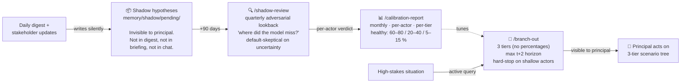
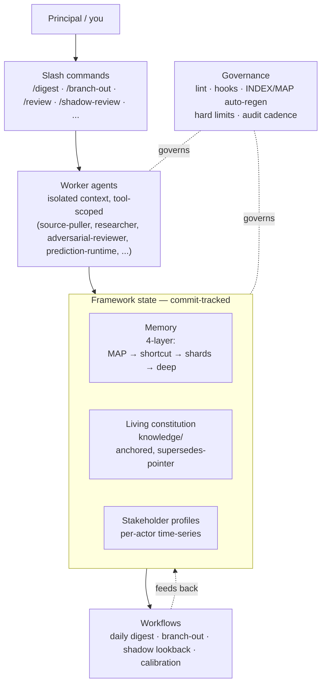

# Giovanni

> Extended hand and second brain.

A **methodology framework** for running an AI Chief of Staff inside Claude Code
— memory architecture, daily digest, predictive layer, governance discipline,
custom subagents, slash commands, living constitution, per-stakeholder modeling,
adversarial-default review.

Distilled from a working domain-specific implementation, then sanitized into a
domain-agnostic framework you can fork and fill with your own context.

## In 10 seconds

Most "AI assistant" repos hand you prompts. Giovanni hands you the **system layer**
underneath the prompts: how to structure memory so it doesn't drift, how to run a
daily digest that survives weeks of compounding context, how to model
stakeholders as time-series (not snapshots), how to predict reactions
**without contaminating the prediction** (shadow hypotheses invisible to the
principal — see [The moat](#the-moat--predictive-layer-with-invisible-shadow-hypotheses)
below), how to enforce honesty via lint and adversarial review.

The runtime lives in your **fork**, not here. This repo is templates, schemas,
agents, workflows, and governance — domain-agnostic on purpose.

## The moat — predictive layer with invisible shadow hypotheses

Most AI assistants either don't predict counterparty behavior, or predict it
**in plain sight** — which contaminates the prediction. The moment you read
"the model expects Sarah to push back on Series B timing", you walk into the
1:1 framing the conversation around it. The prediction becomes self-fulfilling
or self-preventing; either way, the loop is broken. The model's "track record"
becomes a record of *how surfaced predictions changed your behavior*, not
*how well it reads your stakeholders*.

Giovanni's predictive layer is three pieces, designed against this trap:



1. **Branch-out** *(visible)* — active simulation for a specific situation.
   Three likelihood tiers, **no fake percentages** (numeric probabilities on
   small-N stakeholder predictions are vibes with arithmetic decoration). Max
   `t+2` horizon (further is fiction). **Hard-stop on shallow actors**: if
   2+ key actors have <5 observed touches, `/branch-out` refuses to run rather
   than emit caveat-degraded "best effort" predictions.

2. **Shadow hypotheses** *(invisible — the moat)* — predictions the principal
   **never sees** during the prediction window. Stored in
   `memory/shadow/pending/`. Not rendered in digests. Not in 1:1 briefs. Not in
   chat. They become visible only at `/shadow-review`, after the horizon date
   has passed and the outcome is structurally determined. The quarterly review
   runs an **adversarial lookback**: *"what are the strongest arguments this
   hypothesis was NOT fulfilled?"* — default-skeptical on uncertainty, because
   generous verdicts inflate accuracy and corrupt calibration. `>80 %` accuracy
   triggers an immediate re-audit because it usually means tier labels have
   drifted.

3. **Per-actor calibration** *(monthly)* — `/calibration-report` aggregates
   hit rates per actor, per tier. Framework-level accuracy is meaningless;
   what matters is *which specific stakeholders the model reads well and
   which it doesn't*. The score is per-relationship, and it tunes the
   triage heuristic that gates branch-out runs.

The shadow piece is what lets you measure whether the model actually *sees*
your stakeholders, or just generates plausible-sounding narrative. You can't
fake your way through 6 months of invisible predictions and adversarial
review. See [`docs/prediction.md`](docs/prediction.md) for the full binding
rationale (anti-self-fulfilling rule, no-recommendation principle, canonical-
moves discipline, calibration healthy-range bands).

## Architecture



## Who this is for

- Anyone running a **high-context, multi-stakeholder program** (founders,
  chiefs of staff, heads of strategy / legal / operations) who needs an
  assistant that *remembers across weeks* without rotting into noise.
- People who already use Claude Code and want **schema-level discipline**
  instead of stitching together yet another prompt library.
- Builders who want to study **one worked architecture** of memory +
  governance + predictive simulation before designing their own.

Not for: people looking for an out-of-the-box assistant. The work is in
filling Giovanni with your domain context and running it for months.

## Quick start

```bash
# Option A — "Use this template" button on GitHub (top-right) for a clean fork.
# Option B — manual clone:
git clone https://github.com/jaroslavsoucek-art/Giovanni.git my-chief-of-staff
cd my-chief-of-staff

# Validate framework lint passes on the vanilla repo:
./scripts/lint.sh

# Read the fork-and-fill walkthrough:
$EDITOR docs/setup-guide.md
```

For the synthetic test domain (Alex Park / Lattice Finance — used to
stress-test every template), see [`docs/test-domain.md`](docs/test-domain.md)
and the `memory/examples/*.example.md` files.

## Status

**Setup1 architecture complete; runtime unvalidated.** 8/8 specialist
architects shipped; all framework layers have templates, schemas, agents,
workflows, and lint integration. **Not yet end-to-end runtime-tested** —
no fork to actual operational domain, no independent cross-validation, no
Setup2 fork-and-fill walkthrough yet (see
[`docs/setup1-complete.md`](docs/setup1-complete.md) § "What Setup1 did NOT
include"). Hobby project — no commercial support, no roadmap promises.
Built part-time by extracting the system layer from a real high-stakes
operational program with significant strategic stakes, and stripping
out all domain content.

Next stage (Setup2): fork Giovanni into a clean repo, fill with your own
domain content, run actual workflows. **This is where the runtime gets
validated.** See [`docs/setup1-complete.md`](docs/setup1-complete.md) for
the bootstrap summary, [`docs/setup-guide.md`](docs/setup-guide.md) for the
fork-and-fill walkthrough (WIP — iterates as Setup2 surfaces real-world
friction).

## What's in scope

| Layer | Files | Purpose |
|---|---|---|
| **4-layer memory architecture** | `memory/templates/`, `memory/examples/`, `memory/README.md` | MAP → operational shortcut → topic shards → deep storage. Graduation criteria, hard limits, audit cadence. |
| **Living constitution** | `knowledge/constitution.template.md`, `knowledge/README.md`, `knowledge/INDEX.template.md` | Single source of truth, commit-traceable, anchor IDs, supersedes-pointer, auto-INDEX. |
| **Per-stakeholder profiles** | `memory/templates/stakeholder.template.md`, 3 Lattice examples, `docs/stakeholder-profiles.md` | Sentiment trajectory time-series, communication style, predicted reactions, 6-value relationship-type enum. |
| **Daily digest workflow** | `.claude/workflows/daily-digest.md`, `memory/digest-{state,sources}.template.md`, `docs/digest.md` | 12-step procedure, parallel source-puller fan-out, drift detection with 7d ack expiry, brief auto-gen ≤48h, predictive integration. |
| **Predictive layer** — *the moat* | `memory/templates/branch-out.template.md`, `shadow-hypothesis.template.md`, `calibration-actor-score.template.md`, `memory/branch-out/canonical-moves.md`, `docs/prediction.md` | **Branch-out** (3-tier no-percentages, max t+2, hard-stop shallow actors). **Shadow hypotheses** — *invisible to the principal at generation* (anti-self-fulfilling rule, the binding constraint of the layer), reviewed quarterly with **adversarial lookback** (default-skeptical on uncertainty). **Calibration** scoring per-actor monthly with healthy-range bands. See the dedicated section above. |
| **Custom subagents** | `.claude/agents/` (8 architects + 8 workers) | 7 operational worker agents + 8 framework architects. Generic, model-tagged, tool-scoped, isolated context. |
| **Slash commands** | `.claude/commands/` (8 commands + registry + design doc) | `/digest`, `/branch-out`, `/shadow-review`, `/calibration-report`, `/consistency-check`, `/market-radar`, `/review`, `/redline`. |
| **Adversarial-review-as-default** | `.claude/agents/adversarial-reviewer.md`, `.claude/workflows/adversarial-review.md`, `docs/adversarial.md` | SHIP/REWRITE/KILL verdict (no compounds), strongest-counter-case requirement, default-critical, suspend conditions documented. |
| **Governance + lint** | `scripts/lint.{sh,py}`, `scripts/lint_rules/` (11 rules), `scripts/build-{knowledge-index,memory-map}.sh`, `.claude/hooks/` (8 hooks), `docs/governance.md` | Pluggable Python lint framework, INDEX/MAP auto-regen, hard-limit enforcement (300-line, 2% strikethrough), audit cadence (14d light / 35d full), classification rules. |

## What's NOT in scope

- **No domain content.** No stakeholders by name (except Lattice synthetic test domain in examples), no real decision logs, no project specifics.
- **No vendor lock-in.** Works with Claude Code today; designed to migrate to platform-native primitives (Anthropic memory tool, Dreaming, Antigravity SDK) as they ship.
- **No commercial support.** MIT license; fork at your own risk.
- **No automatic value.** Giovanni is templates + workers + workflows + governance. Value comes from filling it with your domain context and running it for months.

## Test domain

`docs/test-domain.md` defines a synthetic 2nd domain (Alex Park / Lattice
Finance — Series A B2B treasury automation SaaS) used to validate every
template + workflow is genuinely generic. Every architect's output is
stress-tested against this domain. See `memory/examples/*.example.md` for
filled artifacts.

## Stats (post-Setup1)

- 8 architect agents + 8 operational agents = 16 total
- 8 slash commands + 11 lint rules + 8 hooks + 8 generic scripts
- 13 memory templates + 14 Lattice examples
- 1 living constitution template + 1 INDEX template + 1 governance config template
- 10 workflow/policy/design docs
- ~104 files, ~17K lines, 19 commits

## Contributing

See [CONTRIBUTING.md](CONTRIBUTING.md). Hard "no domain content" rule,
generic-first check before opening a PR, critical-mode default review.
Hobby project — PRs may sit. Read the realistic-expectations section
before opening anything bigger than a typo.

## License

MIT — see [`LICENSE`](LICENSE).

## Origin

See [`docs/origin.md`](docs/origin.md). Sanitized clean-room extraction from
a private domain-specific implementation; no proprietary content carried
over.
