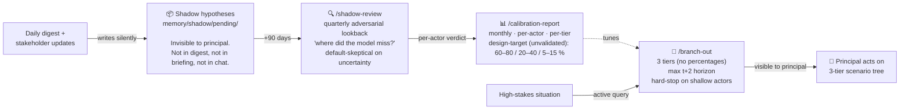
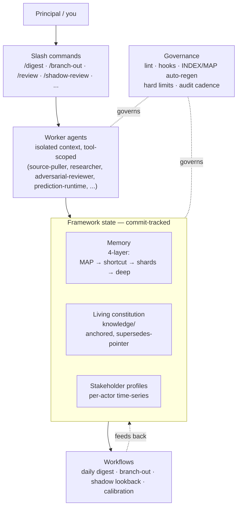

# Giovanni

> Your own AI Chief of Staff — a **generic** assistant anyone can fork, fill, and run. (For teams, [**Boss**](#boss--the-org-layer-on-top) aggregates many Giovannis into one org view.)

## The problem

You run a high-context, multi-stakeholder program — as a founder, chief of
staff, head of strategy / legal / operations. Your reality is a moving
time-series: what each stakeholder believes **this month** vs last, why each
decision was made, what counterparties are likely to do next. You want an AI
assistant that still reads the situation correctly in **month six**, not just
on day one.

A prompt library cannot do this. Prompts are stateless; your reality
compounds and rots. Five specific things go wrong — and none of them are
fixed by a better prompt:

| The pain | What it looks like | What Giovanni does about it |
|---|---|---|
| **Context rot** | A single growing notes/`CLAUDE.md` file becomes a junk drawer within ~4 weeks. Canon, this-week's blockers, and dead items pile into one place until the agent can't tell what's *true* from what's merely *tracked* — and acts on the wrong tier. | **4-layer memory** (MAP → operational shortcut → topic shards → deep storage) with classify-before-append discipline, graduation criteria, and hard limits *with teeth* (300-line L1, 2% strikethrough, 14d/35d audit cadence). |
| **Stale stakeholder snapshots** | You stored a one-time bio for a counterparty. The relationship moved — souring since a specific meeting — and the snapshot silently went wrong. | **Stakeholder profiles as sentiment-trajectory time-series** (append-only), with a 6-value relationship-type enum and a *predicted-reactions* section tied to observed patterns. |
| **Prediction contamination** | The moment you read "expect Sarah to push back on Series B timing," you walk in framing the conversation around it. The prediction self-fulfills or self-prevents; the model's "track record" becomes a record of *how surfacing changed your behavior*, not how well it reads people. | **Invisible shadow hypotheses** — predictions the principal never sees during the window (see [The moat](#the-moat--invisible-shadow-hypotheses)). |
| **Honesty erosion** | RLHF trains the base model helpful-then-*agreeable*. Any review function regresses to "overall solid draft, just one concern…" — surfacing nothing you couldn't see, until you stop asking because it never changes anything. | **Adversarial-as-default review**: forced `SHIP / REWRITE / KILL` enum (no compounds), a *mandatory strongest-counter-case*, default-critical — an explicit reversal of the agreeableness bias, not an opt-in flavor. |
| **Canon ↔ reality drift** | A decision gets made but never propagates to the source-of-truth doc. Memory starts contradicting the constitution. A superseded term resurfaces. Nobody notices until a call is made on stale canon. | **Living constitution** (single source of truth, anchor IDs, supersedes-pointers, decision back-links) + **daily-digest drift detection** + a pluggable **lint/governance** layer that fails the build on contradictions. |

## What this is

Giovanni hands you the system layer *underneath* the prompts: memory that
resists drift, stakeholders modeled as trajectories, predictions that are
testable without contaminating themselves, and governance that keeps an AI
honest instead of agreeable.

Giovanni is a **generic AI Chief of Staff that anyone can stand up for
themselves.** The repo is the *system layer* — templates, schemas, agents,
workflows, governance — domain-agnostic on purpose. You fork it, fill it with
your own constitution, stakeholders, and sources, and run it. Nothing here is
tied to a company or a domain; the synthetic [Lattice
fork](examples/lattice-finance/) just shows what a filled one looks like.
Distilled from a real domain-specific implementation, then sanitized
clean-room. It's a framework you make real by filling it — not an
out-of-the-box product.

## Boss — the org layer on top

Giovanni is **one person's** assistant. When many people each run their own
Giovanni, **Boss** sits one level above and aggregates them.

Boss treats each person's Giovanni as a **source, not as truth**: it reads
their knowledge, decisions, and memory, scores where the org **converges**
(many nodes agree → higher confidence) vs **contradicts**, and surfaces the
contested claims for a human to resolve — producing an *emergent,
confidence-ranked org canon* rather than assuming one exists. **Giovanni is
the node; Boss is the network.**

Boss is a separate, evolving design and lives on its own branch, not on
`main`:

```
main            →  Giovanni — the individual, generic assistant (this README)
Giovanni-Boss   →  Boss — the org-level aggregator over many Giovanni nodes
```

If you just want a personal Chief of Staff, you never touch Boss. If you're
rolling Giovanni out across a team, Boss is how the individual instances add
up to more than their sum — see the
[`Giovanni-Boss`](https://github.com/jaroslavsoucek-art/Giovanni/tree/Giovanni-Boss)
branch.

## The moat — invisible shadow hypotheses

Most AI assistants either don't predict counterparty behavior, or predict it
**in plain sight** — which contaminates the prediction (see the table above).
Giovanni's predictive layer is three pieces, designed against that trap:



1. **Branch-out** *(visible)* — active simulation for a specific situation.
   Three likelihood tiers, **no fake percentages** (numeric probabilities on
   small-N stakeholder predictions are vibes with arithmetic decoration). Max
   `t+2` horizon. **Hard-stop on shallow actors**: if 2+ key actors have <5
   observed touches, `/branch-out` refuses to run rather than emit
   caveat-degraded "best effort" predictions.

2. **Shadow hypotheses** *(invisible — the moat)* — predictions the principal
   **never sees** during the prediction window. Stored in
   `memory/shadow/pending/`, absent from digests / briefs / chat. They become
   visible only at `/shadow-review`, after the horizon has passed and the
   outcome is structurally determined. The quarterly review runs an
   **adversarial lookback** — *"what are the strongest arguments this was NOT
   fulfilled?"* — default-skeptical, because generous verdicts inflate
   accuracy and corrupt calibration. `>80%` accuracy triggers an immediate
   re-audit (it usually means tier labels drifted).

3. **Per-actor calibration** *(monthly)* — `/calibration-report` aggregates
   hit rates **per actor, per tier**. Framework-level accuracy is meaningless;
   what matters is *which specific stakeholders the model reads well*. The
   score tunes the triage heuristic that gates branch-out runs.

The shadow piece is what *lets you measure* — over months, once enough
hypotheses resolve — whether the model actually *sees* your stakeholders or
just generates plausible narrative. The mechanism is designed so you can't
fake your way through it; that measurement has **not happened yet** (no real
shadow hypotheses have resolved — see [Status](#status)). The machinery is
built; the track record is not. Full binding rationale:
[`docs/prediction.md`](docs/prediction.md).

## Architecture



## See it filled — the Lattice Finance fork

Reading templates is abstract. [`examples/lattice-finance/`](examples/lattice-finance/)
is a **complete filled fork** on a synthetic domain (Alex Park / Lattice
Finance — a Series A treasury-automation SaaS): a real constitution, four
stakeholder profiles as trajectories, topic shards, decision records, a
predictive layer (branch-out + shadow + calibration), runtime digest config,
and a rendered digest transcript. It exists to prove the templates compose
into a coherent operational instance — and it is **validated in CI** on every
commit:

```bash
python3 scripts/lint.py            --repo-root examples/lattice-finance   # all governance rules pass
python3 scripts/run-digest-dryrun.py --repo-root examples/lattice-finance # the fork is digest-ready
```

## Who this is for

- Anyone running a **high-context, multi-stakeholder program** who needs an
  assistant that *remembers across weeks* without rotting into noise.
- People who already use Claude Code and want **schema-level discipline**
  instead of stitching together yet another prompt library.
- Builders who want to study **one worked architecture** of memory +
  governance + predictive simulation before designing their own.

Not for: people looking for an out-of-the-box assistant. The work is in
filling Giovanni with your domain context and running it for months.

## Quick start

```bash
# 1. Fork — "Use this template" on GitHub, or clone:
git clone https://github.com/jaroslavsoucek-art/Giovanni.git my-chief-of-staff
cd my-chief-of-staff
git remote set-url origin <your-private-repo-url>   # stakeholder data is sensitive — keep it private

# 2. Scaffold the runtime from templates (copies, creates dirs, regenerates indexes):
bash scripts/init-fork.sh

# 3. Fill it — the multi-hour part: constitution, stakeholders, sources.
$EDITOR docs/setup-guide.md
```

`init-fork.sh` is the mechanical half of "fork in <30 minutes." Filling it
with real domain content — and running the predictive layer long enough to
produce accuracy signals — takes weeks; that's the actual work, walked
through in [`docs/setup-guide.md`](docs/setup-guide.md).

## Status

**Structurally validated end-to-end; not yet run against a real domain.**
8/8 specialist architects shipped; all layers have templates, schemas, agents,
workflows, and lint integration. The bundled [Lattice
fork](examples/lattice-finance/) proves the templates compose into a
lint-clean, digest-ready operational instance, and CI
([`.github/workflows/ci.yml`](.github/workflows/ci.yml)) enforces that on
every commit — plus a fresh-clone `init-fork.sh` smoke test.

What that does **not** yet include: a fork to an actual operational domain
running live `/digest` against real signal; independent cross-validation (the
same agent built the schemas and filled the synthetic examples — confirmation
bias is acknowledged and unresolved). The predictive layer's accuracy claims
are unproven until months of real shadow hypotheses resolve. Hobby project —
no commercial support, no roadmap promises. Sanitized clean-room extraction
from a private domain-specific implementation; no proprietary content carried
over. See [`docs/setup1-complete.md`](docs/setup1-complete.md).

## What's NOT in scope

- **No domain content.** No real stakeholders by name (the Lattice fork is a
  synthetic test domain), no real decision logs, no project specifics.
- **No vendor lock-in.** Works with Claude Code today; designed to migrate to
  platform-native primitives as they ship.
- **No commercial support.** MIT license; fork at your own risk.
- **No automatic value.** Value comes from filling it with your domain
  context and running it for months.

## What's in scope

| Layer | Where | Purpose |
|---|---|---|
| **4-layer memory** | `memory/templates/`, `memory/examples/`, `memory/README.md` | MAP → operational shortcut → topic shards → deep storage. Graduation criteria, hard limits, audit cadence. |
| **Living constitution** | `knowledge/` | Single source of truth, commit-traceable, anchor IDs, supersedes-pointer, auto-INDEX. |
| **Per-stakeholder profiles** | `memory/templates/stakeholder.template.md`, `docs/stakeholder-profiles.md` | Sentiment-trajectory time-series, communication style, predicted reactions, 6-value relationship-type enum. |
| **Daily digest** | `.claude/workflows/daily-digest.md`, `memory/digest-*.template.md`, `docs/digest.md` | 12-step procedure, parallel source-puller fan-out, drift detection with ack expiry, brief auto-gen ≤48h, predictive integration. |
| **Predictive layer** *(the moat)* | `memory/templates/{branch-out,shadow-hypothesis,calibration-actor-score}.*`, `memory/branch-out/canonical-moves.md`, `docs/prediction.md` | Branch-out (3-tier, no %, hard-stop shallow). Shadow hypotheses (invisible at generation). Per-actor monthly calibration. |
| **Custom subagents** | `.claude/agents/` | 8 framework architects + 8 operational workers. Generic, model-tagged, tool-scoped, isolated context. |
| **Slash commands** | `.claude/commands/` | `/digest`, `/branch-out`, `/shadow-review`, `/calibration-report`, `/consistency-check`, `/consistency-review`, `/market-radar`, `/review`, `/redline`. |
| **Adversarial-as-default review** | `.claude/agents/adversarial-reviewer.md`, `docs/adversarial.md` | `SHIP / REWRITE / KILL` (no compounds), strongest-counter-case requirement, default-critical. |
| **Governance + lint + CI** | `scripts/lint.{sh,py}`, `scripts/lint_rules/`, `scripts/build-*`, `scripts/init-fork.sh`, `scripts/run-digest-dryrun.py`, `.claude/hooks/`, `.github/workflows/ci.yml` | Pluggable lint (15 Python rules + 5 bash checks — `scripts/lint.sh --list`), INDEX/MAP/REGISTRY auto-regen, hard-limit enforcement, audit cadence, fork scaffolder, digest-readiness harness, CI. |

## Stats

Loose by design — the live lists are one command away (`bash scripts/lint.sh --list`).

- 8 architect agents + 8 operational agents = 16
- 9 slash commands · 20 lint checks (15 Python rules + 5 bash) · 7 hooks
- 12 memory templates + 12 worked Lattice examples · 1 living-constitution template
- 11 docs in `docs/` + 3 workflows in `.claude/workflows/`
- 1 fully-filled reference fork (`examples/lattice-finance/`) validated in CI

## Contributing

See [CONTRIBUTING.md](CONTRIBUTING.md). Hard "no domain content" rule,
generic-first check before opening a PR, critical-mode default review. Hobby
project — PRs may sit.

## License

MIT — see [`LICENSE`](LICENSE).

## Origin

See [`docs/origin.md`](docs/origin.md). Sanitized clean-room extraction from a
private domain-specific implementation; no proprietary content carried over.
